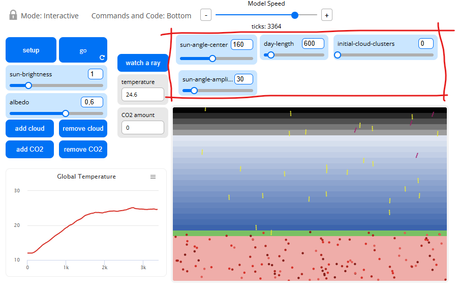
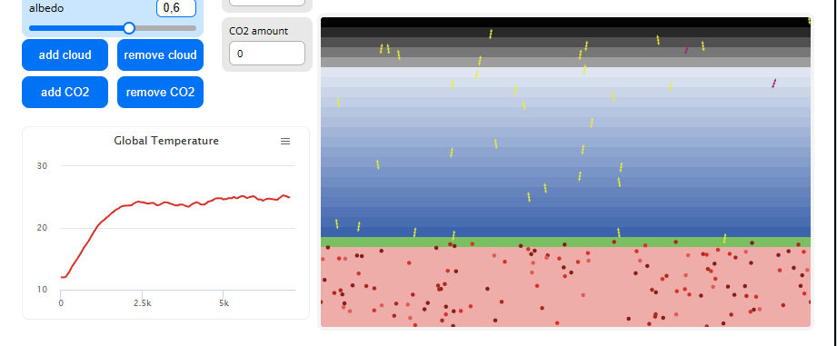

## Комп'ютерні системи імітаційного моделювання
## СПм-24-4, **Бондаренко Вадим Сергійович**
### Лабораторна робота №**1**. Опис імітаційних моделей та проведення обчислювальних експериментів

 

### Варіант 2, модель у середовищі NetLogo:
[Climate Changec](http://www.netlogoweb.org/launch#http://www.netlogoweb.org/assets/modelslib/Sample%20Models/Earth%20Science/Climate%20Change.nlogo) (код змінено, див "Climate Change.nlogox")

 

### Вербальний опис моделі:
Модель симулює спрощений парниковий ефект Землі. Сонячні промені падають на поверхню, частина відбивається (залежно від альбедо та хмарності), решта поглинається й перетворюється в тепло. Земля нагрівається, випромінює інфрачервоні (IR) хвилі, які можуть або втекти в космос, або відбитися від молекул CO_2 і повернутись до поверхні, підіймаючи середню температуру. Таким чином, баланс між сонячним випромінюванням, альбедо, кількістю хмар і концентрацією CO_2 визначає, наскільки “тепло” утримується в системі.

### Внесені зміни в код:

- CO₂ тепер не завжди відбиває ІЧ-випромінювання — це відбувається з певною імовірністю (co2-reflect-prob), що робить ефект плавнішим;
- Хмари іноді не відбивають, а поглинають сонячні промені (cloud-reflect-prob);
- ІЧ-випромінювання може виходити в будь-якій точці поверхні, а не лише в одному вузькому “віконці”;
- Сонячні промені тепер падають рівномірно по всій ширині світу;
- хмари “перетікають” через край екрану, не зникаючи;
- температура оновлюється через регульований коефіцієнт згладжування (temp-alpha).

### Керуючі параметри:
- **sun-brightness** яскравість Сонця (інтенсивність потоку променів).
- **albedo** відбивна здатність поверхні (наскільки Земля відбиває світло).
- **add-cloud / remove-cloud** кнопки для зміни кількості хмар.
- **add-CO2 / remove-CO2** кнопки для зміни кількості молекул CO_2.

### Внутрішні параметри:
- **sky-top, earth-top** межі шарів “неба” і “землі”.
- **cloud-speed** швидкість руху кожної хмари.
- **speed-min** мінімальне значення швидкості агентів. Це загальний параметр для всіх агентів.
- **temperature** глобальна середня температура (змінюється автоматично).

### Показники роботи системи:

Графік “Temperature”:
- по осі X — час (ticks),
- по осі Y — температура (temperature).

Візуальні спостереження на екрані:
- кількість теплових частинок (heats) у ґрунті;
- інтенсивність ІЧ-випромінювання (IRs);
- щільність хмар і CO₂;
- колір поверхні (відбиває зміну альбедо).

### Примітки:
При екстремальних значеннях будь-якого з параметрів система веде себе однозначно і немає сенсу в них її досліджувати.

### Недоліки моделі:
Основні недоліки моделі полягають у її спрощеності: вона не враховує реальну фізику енергообміну, конвекцію, випаровування, теплопровідність, добовий і сезонний цикл освітлення, а атмосфера подана як однорідний шар без вертикального профілю температури чи вологості. Всі процеси (поглинання, відбиття, випромінювання) моделюються простими ймовірностями або “дзеркальними” відбиттями, тож результат — лише якісна ілюстрація парникового ефекту, а не фізично точна симуляція клімату.

 

## Обчислювальні експерименти

### Імітація життя в долюдську епоху

Для цього вимкнемо СО_2, встановимо альбедо в нормальне положення **0,3** і інтенсивність сонця як у звичайний літній день **2,4**

Збільшуємо лише **albedo**:

Збільшуємо лише **brightness**

Бачимо, що **albedo** однозначно зменшує температуру, **brightness** збільшує

### Антропогенного фактору

Тепер в момент часу **500 ітерацій** додаємо хмари і СО_2 в максимум.

Як видно на графіку, тепер температура вирівнялась. Це видно більше на стенді, ніж у графіку, бо всі ІЧ-промені відбиваються назад у землю, а видимі - в космос, тож температура лишається сталою.

### 2. Перевірка гіпотези
 
У моделі ми можемо перевірити, чи впливає початкове розташування елементів (наприклад, випадкове чи рівномірне положення сонячних променів, хмар або СО₂) на середню температуру, яка встановлюється після кількох сотень ітерацій.
Провівши серії запусків з однаковими параметрами (sun-brightness = 2.4, albedo = 0.3, без СО₂), але різним початковим розподілом хмар чи променів, видно, що вже через кілька сотень кроків температура стабілізується на однаковому рівні. Отже, гіпотеза підтверджується — початкова конфігурація не впливає на ефективність “роботи” системи, бо вона швидко приходить до сталого енергетичного балансу.

### 3. Підбір значень параметрів deceleration та acceleration для уникнення пробок на трасі

Аналогічно до дорожньої моделі, тут “пробками” можна вважати локальні перевищення тепла, коли енергія накопичується і не розсіюється. Щоб уникнути цього, експериментально підбирали albedo, sun-brightness, і концентрацію СО₂.
Результати показали: при низькому альбедо (<0.2) система перегрівається, при високому (>0.5) — “затор” енергії не виникає, але й температура падає надто сильно. Оптимальний баланс — albedo ≈ 0.3–0.35 і brightness ≈ 2.4: тепло надходить і частково відбивається, зберігаючи стабільний стан без перегріву. Додавання великої кількості СО₂ після 500 ітерацій зменшує втрати ІЧ-випромінювання, що проявляється як поступове зростання температури — ефект “накопичення трафіку енергії”. Отже, стабільність системи досягається помірним альбедо, помірною інсоляцією і низькою концентрацією СО₂.